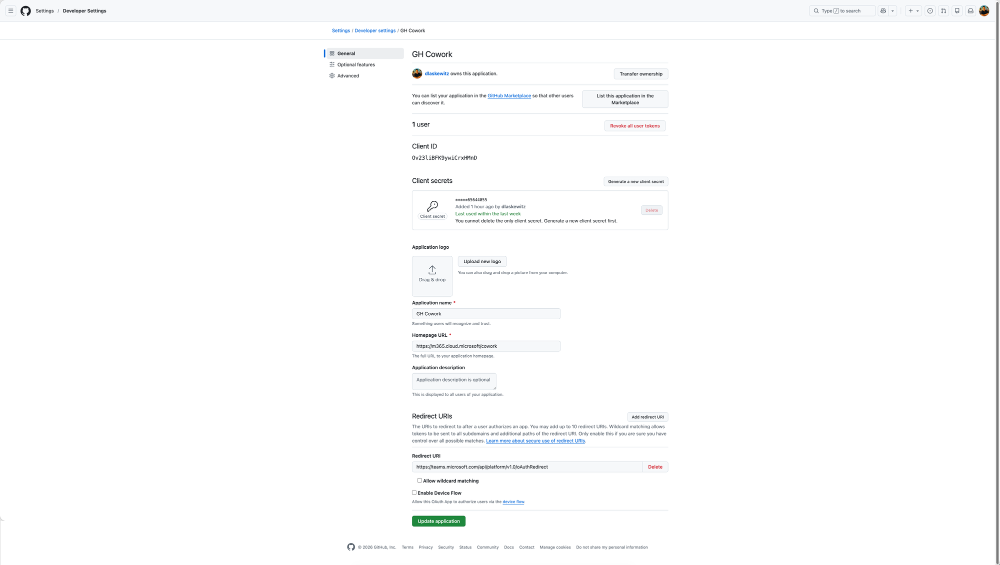
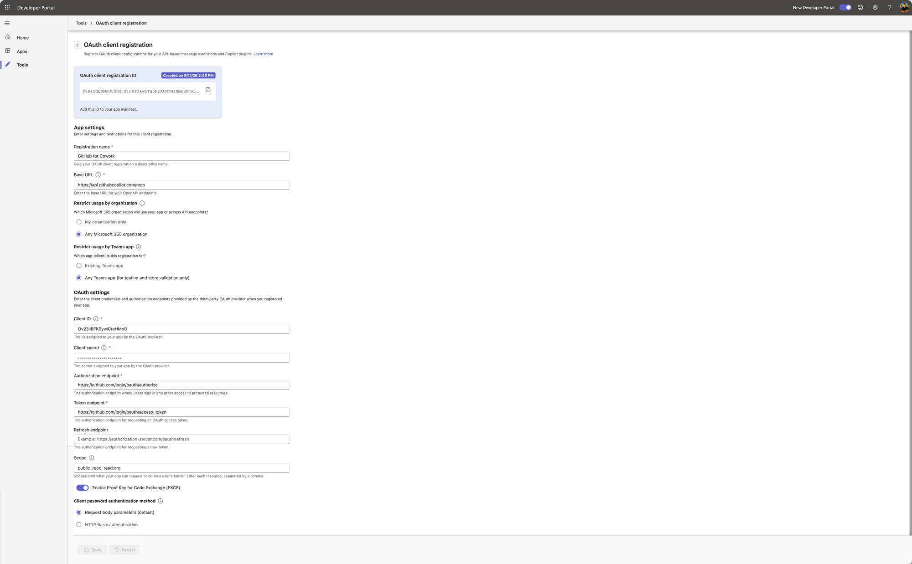
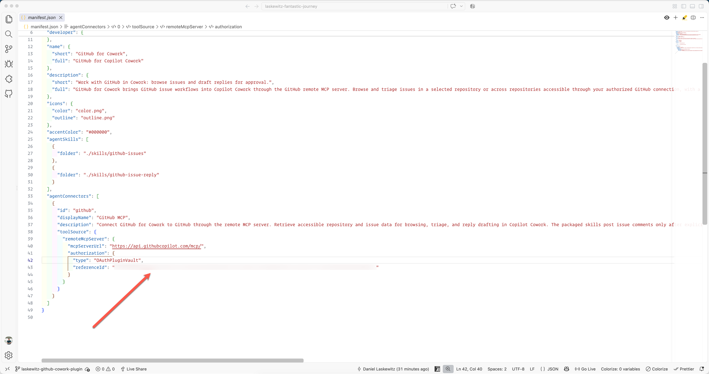

# 🐙 GitHub for Cowork Plugin

Work with GitHub directly in Copilot Cowork. This community-built plugin enables seamless interaction with GitHub repositories.

## Plugin Structure

```
github-for-cowork/
├── skills/
│   ├── github-issues/
│   │   └── SKILL.md               # Lists and triages issues in one repo or across accessible repos
│   ├── github-priority-matrix/
│   │   └── SKILL.md               # Turns open issues into a prioritized action plan
│   ├── github-issue-reply/
│   │   └── SKILL.md               # Reads an issue and discussion, drafts an answer, and posts it only after exact approval
│   ├── github-dependency-audit/
│   │   └── SKILL.md               # Reviews repository dependencies for drift, security risk, and upgrade impact
│   ├── github-branch-cleanup/
│   │   └── SKILL.md               # Spots stale and risky branches and flags safe cleanup candidates
│   └── shared/
│       └── references/
│           └── github-workflow.md # Shared generic worfklows used by the skills
├── color.json                     # Microsoft 365 app color icon
├── manifest.json                  # Microsoft 365 app manifest, contains agent skill and MCP server configuration
├── outline.json                   # Microsoft 365 app outline icon
```

## Features

### Skills

This plugin contains the following skills:

| Skill | What it does | Example | Email report |
| --- | --- | --- | --- |
| `github-issues` | Lists and triages issues in one repo or across accessible repos, with one Markdown table per repo | "List open issues across all repositories I can access." | ✓ |
| `github-priority-matrix` | Turns open issues into a prioritized action plan using an impact vs. effort matrix (low effort/high impact first) | "Give me an action plan for owner/repo based on impact and effort." | ✓ |
| `github-issue-reply` | Reads an issue and discussion, drafts an answer, and posts it only after exact approval | "Propose an answer to owner/repo#42." |  |
| `github-dependency-audit` | Reviews repository dependencies for drift, security risk, and upgrade impact | "Audit the dependencies for owner/repo and rank the risk." | ✓ |
| `github-branch-cleanup` | Spots stale and risky branches and flags safe cleanup candidates | "Review stale branches in owner/repo and show what should be cleaned up." | ✓ |

### GitHub MCP server

This plugin contains the [GitHub MCP server](https://api.githubcopilot.com/mcp/), configured with dynamic tool discovery. Copilot Cowork will discover and use the available tools automatically.

## Plugin Setup

To use the plugin, you must meet the following prerequisites:

- A GitHub account allowed to create an OAuth app.
- A Microsoft 365 account with access to the Teams Developer Portal and permission to register OAuth configuration.

First download the latest release of the plugin on to your machine:

- Download the ZIP from [latest release](https://github.com/Laskewitz/github-for-cowork/releases/tag/v1.0.5) and extract the contents to a folder in a convenient location on your computer.

To enable Copilot Cowork to authenticate with GitHub, you need to create a new OAuth app on GitHub:

- Open a browser and [Register a new OAuth app](https://github.com/settings/applications/new)
- In the form, fill in the following fields:
   - Application name: `GitHub for Cowork`
   - Homepage URL: A public page for your plugin, or `https://m365.cloud.microsoft/cowork` for a Cowork test setup
   - Application description: `Use GitHub issues in Copilot Cowork and post replies after approval.`
   - Redirect URI: `https://teams.microsoft.com/api/platform/v1.0/oAuthRedirect`
- Click **Register application** to complete the setup.
- On the following page, note the **Client ID** as you'll need this later.
- Click **Generate a new client secret**, note the **Client Secret** as you'll need this later.



Next, register the GitHub OAuth app as new OAuth client configuration in Microsoft 365:

- Open a new browser tab and navigate to the [Teams Developer Portal](https://dev.teams.microsoft.com/tools/oauth-configuration/) to register your OAuth app.
- Click **New OAuth client configuration**.
- Fill in the following fields in the App Settings section:
   - Registration name: `GitHub for Cowork`
   - Base URL: `https://api.githubcopilot.com/mcp`
   - Restrict usage by org: `Any Microsoft 365 organization`
   - Restrict ugage by app: `7fee2dee-05a8-48be-9270-9cfb97603d77`
- Fill in the following fields in the OAuth Settings section:
   - Client ID: `<Your GitHub OAuth app Client ID>`
   - Client Secret: `<Your GitHub OAuth app Client Secret>`
   - Authorization endpoint: `https://github.com/login/oauth/authorize`
   - Token endpoint: `https://github.com/login/oauth/access_token`
   - Scope: `repo read:org read:user user:email`
   - Enable `Enable Proof Key for Code Exchange (PKCE)` toggle
   - Click **Save**
- Note the **OAuth client registration ID**, as you'll need this later.



Next, update the app manifest with the OAuth client registration ID.

- Open the folder where you extracted the plugin ZIP and locate the `manifest.json` file.
- Open the `manifest.json` file in a text editor
- Replace `<PLACEHOLDER_REFERENCE_ID>` with the OAuth client registration ID that you obtained from the Teams Developer Portal, and save the file.



Next, install the plugin in Copilot Cowork:

- Continuing in a browser, navigate to [Copilot Cowork](https://copilot.cloud.microsoft/cowork)
- In the left sidebar, click **Customize**.
- Click **Add plugin**.
- Click **Select folder** and choose the folder containing the plugin files.
- Click **Upload** to confirm.
- Click **Publish**. By default, `Only you` will also install the plugin for yourself.
- Verify that the plugin appears in your list of installed plugins.

Finally, with the plugin installed you can now connect it to GitHub and start using its features.

- Click `Connect` on the newly installed plugin to authenticate with GitHub.
- In the authentication popup, sign in to GitHub and approve the requested access.
- Once authenticated, all interactions with the GitHub MCP server will be authorized using your GitHub credentials.

Try out some of the example prompts in the [Skills](#skills) section.

## 🎨 Branding and policies

The 192x192 color icon and 32x32 transparent white icon derive from the
[GitHub mark](https://github.githubassets.com/images/modules/logos_page/GitHub-Mark.png)
and remain subject to [GitHub's logo usage guidelines](https://github.com/logos).
This is a community-built plugin, not an official GitHub app.

## 🙌 Credits

Built together in collaboration with [Garry Trinder](https://github.com/garrytrinder).

## 📚 References

- [Build plugins for Copilot Cowork](https://learn.microsoft.com/microsoft-365/copilot/cowork/cowork-plugin-development)
- [Microsoft 365 app manifest reference](https://learn.microsoft.com/microsoftteams/platform/resources/schema/manifest-schema)
- [Configure OAuth 2.0 authentication](https://learn.microsoft.com/microsoft-365/copilot/extensibility/plugin-authentication-oauth)
- [GitHub OAuth scopes](https://docs.github.com/en/apps/oauth-apps/building-oauth-apps/scopes-for-oauth-apps)
